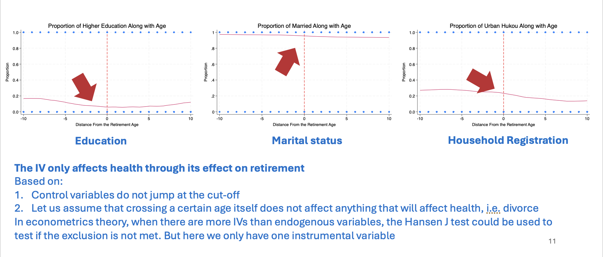

# Effect of Retirement on Health in China

## Project Overview

This project analyzes the effect of retirement on health in China, using data from the China Health and Retirement Longitudinal Study (CHARLS). The analysis explores the relationship between retirement and various health outcomes such as self-reported health, depression, and cognition, with a focus on methodological rigor and robustness checks.

## Structure of the Analysis

1. **Background**
    - Overview of the research question: How does retirement affect health?
    - Importance of reforming retirement, pension, and healthcare policies based on the findings.

2. **Dataset & Sample Preparation**
    - Data Source: CHARLS, a longitudinal field study with an unbalanced panel dataset.
    - Sample Selection: Steps taken to refine the sample, including filtering by age, gender, and retirement status.

3. **Methodology**
    - Model: The analysis uses a fuzzy regression discontinuity design (Fuzzy RD) to address reverse causality.
    - Variables: Detailed discussion of dependent variables (self-reported health, depression, cognition), independent variables (retirement status), and control variables (gender, age, education, etc.).
    - Assumptions: Examination of key econometric assumptions, including no-manipulation, relevance, and exclusion restrictions.

4. **Results, Discussion & Future Research**
    - Key Findings: Retirement negatively impacts the cognition of males, especially those without higher education.
    - External Validity: The findings are most relevant to a specific subset of the population (LATE - Local Average Treatment Effect).
    - Suggestions for Further Research: Includes exploring different estimation methods (Probit/Logit) and expanding control variables.

5. **Appendix**
    - Contains additional regression tables, robustness checks, and diagnostic plots to support the analysis.

6. **Examination of Assumptions**

